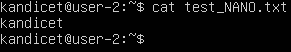
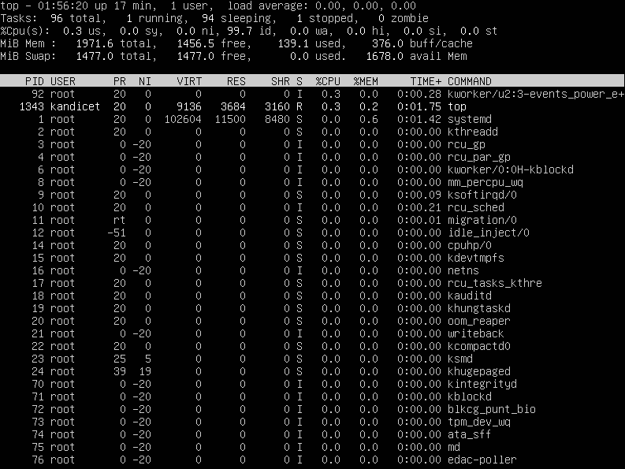

## Part 1. Установка ОС

- Устанавливаем Ubuntu 20.04 Server LTS без графического интерфейса с официального сайта на VirtualBox
- Результат выполнения `cat /etc/issue`

*Версия ОС*

## Part 2. Создание пользователя

- Создаём нового пользователя с помощью команды `useradd`
  - Флаг `-g` нужен для добавления пользователя в группу
  - `adm` - название группы. Она существует по умолчанию, можно проверить её наличие командой `vi /etc/group`

*Создание пользователя*

- Проверяем добавлен ли пользователь в группу `adm`

- Новый пользователь присутствует в выводе команды cat /etc/passwd

*Вывод команды `cat /etc/passwd`*

## Part 3. Настройка сети ОС

- Задаем название машины командой `sudo hostnamectl set-hostname user-1` и проверяем название машины командой `hostname`

- Устанавливаем временную зону с помощью команды `sudo timedatectl set-timezone Asia/Novosibirsk` и проверяем что изменения вступили в силу командой `timedatectl`

- Выводим названия сетевых интерфейсов с помощью команды `ls /sys/class/net`

- `lo` – виртуальный интерфейс, присутствующий по умолчанию в любом Linux. Он используется для отладки сетевых программ и запуска серверных приложений на локальной машине. С этим интерфейсом всегда связан адрес 127.0.0.1. 

- С помощью команды `ip addr show` получаем ip адрес устройства от DHCP сервера - `10.0.2.15`

- `DHCP(Dynamic Host Configuration Protocol)` - протокол прикладного уровня модели TCP/IP, служит для назначения IP-адреса клиенту. 

- С помощью команды `curl ifconfig.me/ip` узнаём внешний ip-адрес шлюза (ip) - `5.137.92.71`

- С помощью команды `ip route | grep default` узнаём ip-адрес по умолчанию (gw) - `10.0.2.2`

*Получение внешнего и внутреннего ip адреса шлюза*

- С помощью команды `sudo vi /etc/netplan/00-installer-config.yaml` задаем вручную ip, gw, dns

*Файл до изменения*

*Файл после изменения*

- С помощью команды `sudo netplan apply` принимаем изменения 

- С помощью команды `reboot` перезагружаем машину

*Проверяем что изменения вступили в силу командой `ip route`*

*Пингуем хост 1.1.1.1, задаём ограничение на 10 пакетов флагом `-c 10`*

*Пингуем хост ya.ru, задаём ограничение на 10 пакетов флагом `-c 10`*

## Part 4. Обновление ОС

- Обновляем системные пакеты до последней версии

- `sudo apt-get update` обновляет локальную базу данных менеджера пакетов, которая содержит информацию обо всех пакетах. При выполнении этой команды менеджер пакетов загружает список доступных обновлений из репозиториев, но не устанавливает сами обновления

- `sudo apt-get upgrade` используется для фактической установки обновлений, которые были загружены с помощью команды `update`. При выполнении этой команды менеджер пакетов обновляет конкретные пакеты до их последних версий, если такие версии доступны

*При повторном вводе команды получаем сообщение об отсутствии обновлений*

## Part 5. Использование команды **sudo**

- Разрешаем пользователю, созданному Part 2, выполнять команду sudo
  - `sudo` ( substitute user and do, подменить пользователя и выполнить ) - это утилита для операционных систем семейства Linux, позволяющая пользователю запускать программы с привилегиями другой учётной записи, как правило, суперпользователя

- Для того чтобы дать пользователю `user1` право использовать `sudo` необходимо добавить его в группу `sudo` с помощью команды `sudo usermod -a -G sudo user1` 
  - `usermod` - изменяет учётную запись пользователя
  - Флаг `-a` нужен чтобы добавить пользователя в указанную группу без удаления его из других групп
  - Флаг `-G` указывает на группу, к которой нужно добавить пользователя

*Проверяем что пользователь newuser добавлен в группу `sudo` с помощью команды `groups`*

- Меняем hostname ОС на `user-2` от имени `user1` командой `sudo -u newuser hostnamectl set-hostname user-2`
  - Флаг `-u` необходим для выполнения команды от имени другого пользователя

*Проверяем что имя хоста изменено командой `hostname`*

## Part 6. Установка и настройка службы времени

- Настраиваем службу автоматической синхронизации времени

*Проверяем что вывод команды `timedatectl show` содержит `NTPSynchronized=yes`*

*Командой `date` проверяем что текущее время корректно*

## Part 7. Установка и использование текстовых редакторов

- Устанавливаем текстовые редакторы
  
  - Редактор `vim` уже установлен, но если его нет, та можно установить с помощью команды `sudo apt install vim`
  - Редактор `nano` уже установлен, но если его нет, та можно установить с помощью команды `sudo apt install nano`
  - Редактор `mcedit` устанавливаем командой `sudo apt install mc`

- Создаём файл в редакторе `vim` командой `vim test_vim.txt`
- Для редактирования файла необходимо нажать клавишу `I`
- Чтобы выйти из режима редактирования нажимем клавишу `Esc`
- Для сохранения и выхода пишем `:wq` и нажимаем `Enter`

*Содержимое файла перед закрытием*

- Создаём файл в редакторе `nano` командой `nano test_nano.txt`
- Нажимаем `Ctrl+O` для сохранения изменений, затем `Enter`
- Нажимаем `Ctrl+X` для выхода из программы

*Содержимое файла перед закрытием*

- Создаём файл в редакторе `mcedit` командой `mcedit test_mcedit.txt`
- Нажимаем `F2` `Save` для сохранения изменений 
- Нажимем `F10` для выхода из программы

*Содержимое файла перед закрытием*

- Открываем файл для редактирования в `vim` командой `vim test_vim.txt`
- Для редактирования файла необходимо нажать клавишу `I`
- Чтобы выйти из режима редактирования нажимем клавишу `Esc`
- Для выхода без изменений пишем `:q!` и нажимаем `Enter`

*Содержимое файла перед закрытием*

*Проверяем что изменения не сохранены*

- Открываем файл в редакторе `nano` командой `nano test_nano.txt`
- Нажимаем `Ctrl+X` для выхода из программы, вводим `N`

*Содержимое файла перед закрытием*

*Проверяем что изменения не сохранены*

- Открываем в редакторе `mcedit` командой `mcedit test_mcedit.txt`
- Нажимем `F10` `No` для выхода из программы

*Содержимое файла перед закрытием*

*Проверяем что изменения не сохранены*

- Открываем файл для редактирования в `vim` командой `vim test_vim.txt`
- Для поиска слова `School` используем команду `/School`

*Результат выполнения поиска по слову*

- Для замены слова `school` на слово `test` используем команду `:s/school/test`

*Результат замены*

- Открываем файл в редакторе `nano` командой `nano test_nano.txt`
- Для поиска слова `School` используем сочетание клавиш `Ctrl+W`

*Результат выполнения поиска по слову*

- Для замены слова `School` на слово `Test` используем сочетание клавиш `Ctrl+\`, вводим слово, которое надо заменить, а затем на какое надо заменить

*Результат замены*

- Открываем в редакторе `mcedit` командой `mcedit test_mcedit.txt`
- Для поиска по слову нажимем `F7` и вводим слово

*Результат выполнения поиска по слову*

- Для замены слова `School` на слово `Test` нажимаем `F4`. В верхнюю строку вводим слово которое надо заменить, а в нижнюю - на какое

*Замена слова*

*Результат замены*

## Part 8. Установка и базовая настройка сервиса **SSHD**

- Установливаем службу SSHd

- Командой `sudo apt-get install ssh` устанавливаем ssh-клиент

- Командой `sudo apt install openssh-server` устанавливаем ssh-сервер

- Добавляем автостарт службы при загрузке системы 

*Командой `sudo systemctl enable sshd` добавляем пакет SSH-сервера в автозагрузку*

*Командой `systemctl status sshd` проверяем работоспособность ssh*

- Перенастраеваем службу SSHd на порт 2022

- Для замены порта необходимо открыть файл конфигурации командой `sudo vim /etc/ssh/sshd_config` и изменить номер порта

*Меняем порт с `22` на `2022`*

*Перезагружаем систему и убеждаемся что порт изменен*

- Покажем наличие процесса sshd

- Для отображения процесса `sshd` с помощью команды `ps` используем команду `ps aux | grep sshd`
  
  - `ps (process status)` - команда, которая выводит список текущих процессов на вашем сервере
  - Ключ `a` в команде `ps` позволяет отображать процессы всех пользователей, а не только текущего пользователя. Он показывает процессы по всей системе
  - Ключ `u` в команде `ps` позволяет выводить дополнительную подробную информацию о каждом процессе, такую как имя пользователя владельца процесса, идентификатор пользователя (UID), процесс ID (PID), процент использования ЦП и памяти и другие параметры
  - Ключ `x` в команде `ps` предназначен для включения в вывод процессы, которые не являются терминальными, то есть процессы, которые не связаны с текущим терминалом (например, процессы демонов)
  - `|` - это символ pipe, который направляет вывод `ps aux` на ввод команды `grep`
  - `grep sshd` - используется для фильтрации вывода, отображая только строки, содержащие `sshd`

*Вывод команды `ps aux | grep sshd`*

- Перезагружаем систему командой `reboot`

- `Netstat` — происходит от слов network statistics — это утилита командной строки, используемая системными администраторами для анализа статистики сети. Она отображает всю статистику, такую как открытые порты и соответствующие адреса в хост-системе, таблицы маршрутизации и masquerade соединения

- Ключ `-t` в команде `netstat` используется для отображения только TCP-соединений

- Ключ `-a` в команде `netstat` показывает все сетевые соединения и порты, включая слушающие и активные соединения

- Ключ `-n` в команде `netstat` переключает отображение адресов и портов в числовой формат, а не в символьные имена. Это удобно для быстрого определения числовых значений IP-адресов и портов

*Вывод команды `netstat -tan`*

- `Proto` - протокол соединения
- `Recv-Q`- количество байт, ожидающих чтения приемником
- `Send-Q`- количество байт, ожидaющих отправки
- `Local Address` - IP-адрес и порт на локальной машине
- `Foreign Address` - IP-адрес и порт на удаленной машине
- `State*` - состояние TCP-соединения
- `0.0.0.0` или `:::*` означает что соединение доступно через любой сетевой интерфейс

## Part 9. Установка и использование утилит **top**, **htop**

- Установливаем и запускаем утилиты top и htop

*Вывод команды top*

- Uptime 01:56:20 up 17 min
- Количество авторизованных пользователей - 1
- Общая загрузка системы - 0:00, 0:03, 0:02
- Общее количество процессов - 96
- Загрузка cpu - 0.3 us, 0.0 sy, 0.0 ni, 99.7 id, 0.0 wa, 0.0 hi, 0.0 si, 0.0 st
- Загрузка памяти MIB Mem: 1971.6 total, 1456.5 free, 139.1 used, 376.0 buff/cache
- Загрузка памяти MIB Swap: 1477.0 total, 1477.0 free, 0.0 used, 1678.0 avail Mem
- pid процесса занимающего больше всего памяти - 1
- pid процесса, занимающего больше всего процессорного времени - 1343
  

*Вывод команды `htop`, отсортированный по PID*

*Вывод команды `htop`, отсортированный по PERCENT_CPU*

*Вывод команды `htop`, отсортированный по PERCENT_MEM*

*Вывод команды `htop`, отсортированный по TIME*

*Вывод команды `htop`, отфильтрованный для процесса sshd*

*Вывод команды `htop` с процессом syslog, найденным, используя поиск*

*Вывод команды `htop` с добавленным выводом hostname, clock и uptime*

## Part 10. Использование утилиты **fdisk**

- Запускаем команду fdisk -l

*Вывод команды `fdisk -l`*

- Название жесткого диска - /dev/sda
- Размер жесткого диска 10 GiB
- Количество секторов - 20971520
  

*Размер swap получаем командой `free -h`*

## Part 11. Использование утилиты **df**

- Запускаем команду df
  
  
  
  - Размер раздела - 8408452
  - Размер занятого пространства - 4295976
  - Размер свободного пространства - 3663760
  - Процент использования - 54%
  - Единица измерения - KiB 

- Запускаем команду df -Th
  
  
  
  - Размер раздела - 8.1 Gb
  - Размер занятого пространства - 4.1 Gb
  - Размер свободного пространства - 3.5 Gb
  - Процент использования - 54%
  - Тип файловой системы - ext4

## Part 12. Использование утилиты **du**

- Запускаем команду du

- Выводим размер папок /home, /var, /var/log (в байтах, в человекочитаемом виде)
  - `-h` для представления размеров в удобочитаемом формате
  - `-s` используется для вывода общего размера папки

*Вывод команд `du -h /home и du -sh /home`*

*Вывод команд `sudo du -h /var и sudo du -sh /var`*

*Вывод команд `sudo du -h /var/log и sudo du -sh /var/log`*

- Выведим размер всего содержимого в /var/log (не общее, а каждого вложенного элемента, используя *)
  - Флаг `-a` нужен, чтобы выводить размер для всех файлов, а не только для директорий

*Вывод команды `sudo du -ah /var/log/*`*

## Part 13. Установка и использование утилиты **ncdu**

- Устанавливаем утилиту `ncdu` командой `sudo apt install ncdu`

- Выведим размер папок /home, /var, /var/log

*Вывод команды `ncdu /home`*

*Вывод команды `ncdu /var`*

*Вывод команды `ncdu /var/log`*

## Part 14. Работа с системными журналами

- Открываем для просмотра:
  
  - /var/log/dmesg
  
  
  
  *Вывод команды `vim /var/log/dmesg`*
  
  - /var/log/syslog
  
  
  
  *Вывод команды `vim /var/log/syslog`*
  
  - /var/log/auth.log
  
  
  
  *Вывод команды `vim /var/log/auth.log`*
  
  - Время последней успешной авторизации 10:08:2024 08:31:58
  - Имя пользователя - kandicet
  - Строка `pam_unix(systemd-user:session)` указывает на метод аутентификации пользователей `pam_unix` с использованием подсистемы `systemd-user:session` в системе

- Перезапускаем службу SSHd командой `sudo systemctl restart sshd`

*Сообщение о перезапуске службы sshd в логах*

## Part 15. Использование планировщика заданий **CRON**

- Открываем файл crontab для редактирования командой `crontab -e`

- Добавляем в него строчку `*/2 * * * * uptime`

*В системном журнале каждые 2 мин появляется строчка о выполнении `uptime`*

- Командой `crontab -l` выводим список текущих задач для CRON

*Cписок текущих задач для CRON*

*Стровки в системных журналах о выполнении*

- Удаляем все задания из планировщика заданий

*Все задачи удалены*